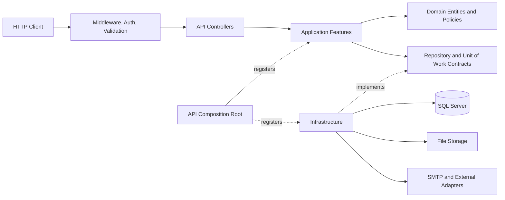
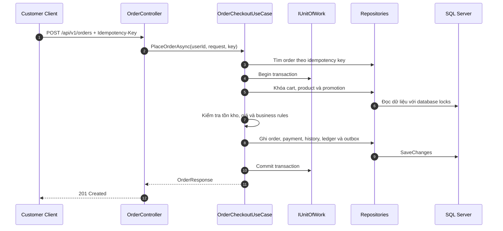
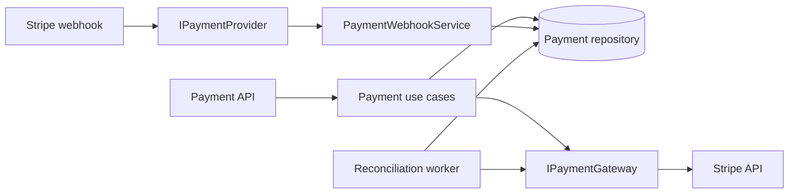

# ECommerce Backend


[](https://github.com/Giapnocap/ECommerceBackend/actions/workflows/ci.yml)

REST API cho hệ thống thương mại điện tử, xây dựng bằng ASP.NET Core 8 và SQL Server. Dự án tập trung
vào tính nhất quán dữ liệu, phân quyền, xử lý đồng thời và khả năng vận hành của các luồng backend
thực tế. Repository tập trung vào backend và database, đồng thời có Docker Compose cho môi trường
local; frontend và hạ tầng cloud không thuộc phạm vi triển khai.

## Mục Lục

- [Điểm kỹ thuật nổi bật](#điểm-kỹ-thuật-nổi-bật)
- [Công nghệ](#công-nghệ)
- [Chức năng chính](#chức-năng-chính)
- [Administrative Capabilities](#administrative-capabilities)
- [Kiến trúc](#kiến-trúc)
- [Authentication Security](#authentication-security)
- [Payment Architecture](#payment-architecture)
- [Payment Flow](#payment-flow)
- [Webhook Processing](#webhook-processing)
- [Refund Flow](#refund-flow)
- [Multi-Currency Architecture](#multi-currency-architecture)
- [Phân quyền](#phân-quyền)
- [Phiên bản API](#phiên-bản-api)
- [Bằng chứng chất lượng](#bằng-chứng-chất-lượng)
- [Quick Start với Docker](#quick-start-với-docker)
- [Chạy local không Docker](#chạy-local-không-docker)
- [Kiểm thử API](#kiểm-thử-api)
- [Testing](#testing)
- [Đóng gói release](#đóng-gói-release)
- [Known Limitations](#known-limitations)
- [Bảo mật cấu hình](#bảo-mật-cấu-hình)

## Điểm Kỹ Thuật Nổi Bật

- Checkout khóa cart và product theo thứ tự ổn định trong một transaction.
- `Idempotency-Key` ngăn tạo trùng order khi client retry cùng yêu cầu.
- Row version, unique constraints và SQL locks bảo vệ các luồng có race condition.
- Order lưu snapshot người nhận; order detail lưu snapshot tên và giá để bảo toàn lịch sử.
- Payment webhook xác thực HMAC, event ID và payload trước khi thay đổi trạng thái.
- Stripe PaymentIntent/refund chạy ngoài SQL transaction, sau đó được hoàn tất bằng transaction ngắn và idempotent.
- Tiền tệ dùng value object `Money`; order, line item và refund lưu snapshot VND để báo cáo không cộng sai các loại tiền.
- Payment reconciliation tự phục hồi giao dịch ngoài cổng thanh toán nhưng chưa được cập nhật vào database.
- Transactional outbox ghi cùng transaction với business data, có retry, dead-letter và redrive.
- Mọi thay đổi tồn kho đều sinh inventory ledger entry kèm số dư sau giao dịch.
- Correlation ID liên kết `ProblemDetails`, request log và audit event.

## Công Nghệ

- .NET 8, ASP.NET Core Web API
- Entity Framework Core, SQL Server
- JWT Bearer, role và permission policies
- FluentValidation và mapping response tường minh
- Serilog, ProblemDetails, correlation ID
- Swagger/OpenAPI
- Docker multi-stage build và Docker Compose cho môi trường local
- xUnit unit tests, API/EF Core integration tests và SQL Server integration tests

## Chức Năng Chính

- Đăng ký, xác minh email, đăng nhập, quản lý phiên, refresh-token rotation, phát hiện token reuse và thu hồi phiên.
- Quản lý người dùng và phân vai trò `Admin`, `Staff`, `Customer`.
- CRUD danh mục, sản phẩm và ảnh sản phẩm.
- Tìm kiếm, lọc, sắp xếp và phân trang sản phẩm.
- Giỏ hàng và checkout có `Idempotency-Key`.
- Báo giá checkout phía server, phí giao hàng cấu hình được và promotion có giới hạn tổng/theo khách.
- Vận đơn một-một lưu đơn vị vận chuyển, mã theo dõi, thời điểm xuất giao và giao thành công.
- Quy trình trả hàng gồm Customer yêu cầu, Staff duyệt/từ chối, nhận kiểm hàng, hoàn kho và hoàn tiền.
- Giữ/hoàn tồn kho có inventory ledger riêng cho hủy đơn và nhận hàng hoàn.
- Payment state machine, COD, Stripe PaymentIntent, hoàn tiền toàn phần/một phần và webhook chống replay.
- Checkout đa tiền tệ có snapshot tỷ giá; adapter CurrencyAPI có cache, stale fallback và timeout.
- Transactional outbox, retry, dead-letter và redrive.
- Báo cáo doanh thu, trạng thái đơn, sản phẩm bán chạy và tồn kho thấp.
- Audit trail cho các thao tác đặc quyền và đối soát file upload.

## Administrative Capabilities

Các capability quản trị tái sử dụng policy, transaction, locking, ledger và audit hiện có; không tạo một luồng ghi dữ liệu song song.
Route `/api/v1/...` tương đương với các route không version dưới đây.

| Capability | Endpoint chính | Quyền |
|---|---|---|
| Dashboard vận hành | `GET /api/admin/dashboard/*` | `view_reports` |
| Quản lý tồn kho | `GET /api/admin/inventory`, stock-in, adjustment, history | `manage_products` |
| Quản lý khách hàng | `GET /api/admin/customers/*`, lock/unlock | `manage_users` |
| Báo cáo | `GET /api/admin/reports/revenue|orders|products|customers|returns` | `view_reports` |
| Nhật ký audit | `GET /api/operations/audit-events` và `/{id}` | role `Admin` |
| Analytics promotion | `GET /api/admin/promotions/analytics` và `/{id}/analytics` | `manage_products` |

- Dashboard và report dùng projection, `AsNoTracking` và aggregate trong database; các list đều có giới hạn/pagination phù hợp.
- Revenue report xác định gross theo `Payment.PaidAt`; refund online lấy từ `PaymentRefund.BaseAmount`, refund COD lấy từ history `ManualRefund`, full refund ngoài hệ thống có fallback webhook/reconciliation chống đếm đôi; net bằng gross trừ refund.
- Promotion analytics dùng `PromotionRedemption` và snapshot order: gross là subtotal, net là subtotal trừ discount; không gán doanh thu đã thu hoặc hoàn tiền cho promotion khi schema chưa lưu quan hệ đó.
- Audit query hỗ trợ actor/action/resource/resource-id/thời gian. Password, token, secret, API key và credential được redaction khi ghi và khi trả API.

## Kiến Trúc



```text
src/
  ECommerceBackend/
    API/              Controllers, middleware, composition root và Swagger
  ECommerceBackend.Application/
    Features/         Capability-owned DTO, validator, service, use case và repository contract
      Auth, Users, Catalog, Carts, Orders, Payments,
      Promotions, Inventory, Reports, Operations, Notifications/
    Common/           Paging, options và application primitives dùng chung
    Interfaces/       Chỉ chứa transaction, consistency, request context và persistence dùng chung
    Mappings/         Response mapping dùng qua nhiều feature
  ECommerceBackend.Domain/
    Entities/         Entities và aggregate state
    Enums/            Status và state transitions
    Policies/         Business policies
  ECommerceBackend.Infrastructure/
    Data/Repositories/ EF Core repository implementations
    Data/Configurations/ Entity mappings, indexes, constraints và seed data
    Migrations/       SQL Server migration history
    Notifications/    Outbox processing và notification adapters
    Payments/         Payment provider adapters
tests/
  ECommerceBackend.UnitTests/
    Application/     Validator và application rules không dùng Infrastructure
    Domain/          Aggregate, policy và state-machine tests
  ECommerceBackend.IntegrationTests/
    API/             HTTP contracts, middleware và OpenAPI baseline
    Auth, Catalog, Carts, Orders, Payments, Operations/
                     Service/repository workflows theo feature
    SqlServer/       Migration, transaction, recovery và performance tests
    Support/         Fixture và factory dùng chung
```

Solution gồm sáu project: API host `src/ECommerceBackend/ECommerceBackend.csproj`, `Domain`, `Application`,
`Infrastructure`, `ECommerceBackend.UnitTests` và `ECommerceBackend.IntegrationTests`. Khi chạy bằng Visual Studio, đặt project
`API` trong solution folder `src` làm Startup Project; các project layer là class library và không chạy
độc lập.

`src/ECommerceBackend/Program.cs` là composition root. Controller không chứa transaction logic; Application điều phối use case và transaction qua repository cùng `IUnitOfWork`; Domain bảo vệ invariant; Infrastructure triển khai EF Core persistence, locking và external adapters.

Source trong Application được nhóm theo capability để một luồng nghiệp vụ nằm gần các DTO,
validator, facade, use case và repository contract liên quan. Namespace hiện tại được giữ ổn định;
việc tổ chức lại thư mục không làm thay đổi API hoặc dependency direction giữa các project.

Đăng ký dependency thuộc về
`ECommerceBackend.Application/DependencyInjection.cs` và
`ECommerceBackend.Infrastructure/DependencyInjection.cs`; API chỉ ghép các module tại composition root.
`AppDbContext` chỉ khai báo `DbSet` và nạp
`IEntityTypeConfiguration<T>` từ `src/ECommerceBackend.Infrastructure/Data/Configurations`; mapping không nằm trong
application service. Repository là các contract theo feature, không sử dụng generic repository và
không expose `DbSet` hoặc `IQueryable` qua tầng Application.

### Checkout

```text
Request -> Validation -> Idempotency -> Transaction -> Lock -> Re-check
        -> Business rules -> Persist order/payment/inventory/outbox -> Commit
```



### Refresh Token

```text
Refresh token -> SHA-256 hash -> Transaction -> Lock user/token -> Validate
              -> Detect reuse -> Revoke family khi cần -> Rotate -> Commit
```

Raw refresh token chỉ trả cho client; database lưu hash. Mỗi lần refresh hợp lệ thu hồi token cũ,
tạo token thay thế trong cùng family và giữ nhiều phiên thiết bị độc lập. Reuse một token đã rotate
sẽ thu hồi các token còn hoạt động trong family đó.

### Transactional Outbox

```text
Business transaction -> Outbox row -> Commit -> BackgroundService
                     -> Claim lease -> Dispatch -> Retry/backoff -> Dead-letter/redrive
```

Outbox row được ghi cùng transaction với dữ liệu nghiệp vụ. Worker không dùng hàng đợi in-memory;
lease trong database cho phép khởi động lại và nhiều worker cạnh tranh an toàn. Delivery qua SMTP
là at-least-once nên consumer nhận `Message-ID` xác định để hỗ trợ chống trùng.

## Authentication Security

- Password được băm bằng BCrypt; đăng nhập có lockout theo số lần thất bại và không tiết lộ tài khoản có tồn tại hay không.
- Access token chứa `session_id`; phiên bị khóa hoặc thu hồi không tiếp tục sử dụng được dù JWT chưa hết hạn.
- Refresh token chỉ lưu SHA-256 hash, được rotate theo token family và thu hồi cả family khi phát hiện reuse.
- Người dùng có thể xem, thu hồi một phiên hoặc đăng xuất toàn bộ thiết bị.
- Email verification và password reset dùng token ngẫu nhiên một lần, chỉ lưu hash, có thời hạn và gửi qua transactional outbox.
- Endpoint đặc quyền dùng permission policy; audit metadata được redaction trước khi lưu và trước khi trả API.

## Payment Architecture

`IPaymentGateway` tách Application khỏi Stripe SDK/HTTP contract. `StripePaymentGateway` chịu trách nhiệm tạo và
đọc PaymentIntent, tạo refund, chuyển đổi minor units theo từng currency, timeout và ánh xạ lỗi provider.
`IPaymentProvider` xử lý webhook; resolver chọn provider theo route mà không đưa Stripe type vào Application.



Stripe và CurrencyAPI mặc định tắt. Secret chỉ được cấp qua environment variable/secret store; repository không
chứa API key thật.

## Payment Flow

1. Checkout tạo order và payment nội bộ bằng `Idempotency-Key` trong transaction.
2. Initialize payment chiếm lease/idempotency record trong transaction ngắn rồi commit.
3. API gọi Stripe ngoài SQL transaction, vì network I/O không được giữ database lock.
4. Kết quả PaymentIntent được ghi lại bằng transaction thứ hai; retry cùng key trả lại cùng payment.
5. Reconciliation worker truy vấn các payment stale ở trạng thái active và áp dụng transition hợp lệ nếu webhook bị trễ/mất.

## Webhook Processing

- Endpoint Stripe đọc raw request body và xác minh `Stripe-Signature` trong tolerance window cấu hình.
- Provider event ID có unique constraint để chống replay; payload được giới hạn kích thước và không lưu raw body mặc định.
- Payment ID, provider transaction ID, amount và currency phải khớp snapshot nội bộ trước khi đổi trạng thái.
- Event và status history được ghi trong cùng transaction. Duplicate delivery trả thành công nhưng không tạo side effect lần hai.

## Refund Flow

Refund online dùng reference làm idempotency key. Use case khóa order/payment, giữ trước số tiền có thể hoàn và commit;
sau đó gọi Stripe ngoài transaction rồi hoàn tất payment, return request, order history, outbox và audit trong transaction mới.
Hệ thống hỗ trợ refund một phần và toàn phần, không cho tổng refund vượt payment amount. Mỗi `PaymentRefund` lưu cả
amount/currency gốc và `BaseAmount`/`BaseCurrency`; lần refund cuối nhận phần base còn lại để không phát sinh sai số cộng dồn.
Refund COD là thao tác ghi nhận thủ công sau khi hàng hoàn đã được nhận, dùng status history nguồn `ManualRefund`.

## Multi-Currency Architecture

- `CurrencyCatalog` hiện định nghĩa VND (0 chữ số thập phân), USD và EUR (2 chữ số); `Money` kiểm tra scale và overflow.
- VND là base currency. Quote/checkout lấy tỷ giá trước khi mở transaction và lưu `ExchangeRate`, thời điểm lấy tỷ giá,
  base/display subtotal, discount, shipping, tax, total cùng `OrderDetail.BaseUnitPrice`.
- CurrencyAPI adapter dùng timeout, cache theo cặp tiền, single-flight chống gọi trùng và stale fallback có giới hạn.
- Dashboard, customer analytics và report chỉ tổng hợp base snapshots VND; API trả rõ currency của số liệu.
- Refund luôn gửi đúng currency của payment gốc và dùng snapshot tỷ giá order, không gọi tỷ giá hiện tại.

Tài liệu thiết kế:

- [Kiến trúc và business invariants](docs/ARCHITECTURE.md)
- [Database ERD](docs/ERD.md)
- [Sequence các luồng quan trọng](docs/SEQUENCES.md)
- [Monitoring và cảnh báo](docs/MONITORING.md)
- [Kịch bản demo backend](docs/DEMO.md)
- [Runbook vận hành](docs/RUNBOOK.md)
- [Báo cáo production readiness](PRODUCTION_READINESS_REPORT.md)
- [Hiệu năng và quyết định scale](docs/PERFORMANCE.md)
- [Giới hạn hệ thống](docs/LIMITATIONS.md)
- [Báo cáo capability đã triển khai](FULL_UPGRADE_REPORT.md)

## Phân Quyền

| Vai trò | Phạm vi chính |
|---|---|
| `Customer` | Giỏ hàng, checkout, xem/hủy đơn thuộc sở hữu và yêu cầu trả hàng |
| `Staff` | Xác nhận đơn, vận đơn, giao hàng, xét duyệt/nhận hàng hoàn và xem tồn kho |
| `Admin` | Toàn bộ quyền Staff, quản lý catalog/user, báo cáo và operations |

Các endpoint quản trị sử dụng permission policies. Riêng operations recovery và audit yêu cầu role `Admin`.

## Phiên Bản API

- Route khuyến nghị: `/api/v1/...`.
- Route cũ `/api/...` vẫn hoạt động với phiên bản mặc định `1.0` để không phá client hiện tại.
- Response của endpoint hợp lệ có header `api-supported-versions`.
- Swagger/OpenAPI v1: `/swagger/v1/swagger.json` và `/swagger`.
- Thông báo và `ProblemDetails` dùng tiếng Việt; trường `code` giữ tiếng Anh ổn định cho client.

## Bằng Chứng Chất Lượng

| Hạng mục | Cơ chế kiểm chứng |
|---|---|
| Chất lượng build | Nullable reference types và warning-as-error cho toàn solution |
| Biên kiến trúc | Test chặn dependency sai chiều và EF Core rò rỉ vào Application |
| Hợp đồng API | OpenAPI v1 snapshot test, kiểm tra route cũ và `/api/v1` |
| Tính đúng dữ liệu | SQL Server integration test cho transaction, lock, idempotency và concurrency |
| Migration | Kiểm tra model drift, script nâng cấp/rollback, backup và restore drill |
| Coverage | CI chặn khi line coverage dưới 80% hoặc branch coverage dưới 60% |
| Hiệu năng | Budget SQL Server cho catalog, dashboard/report, login/refresh, session và checkout 50 dòng |
| Release | ZIP có manifest, SHA-256, migration artifact và smoke test health endpoint |

Baseline backend được xác minh local và trên CI đến ngày `09/08/2026`:

| Kiểm tra | Kết quả |
|---|---:|
| Release build | Đạt, 0 lỗi và 0 cảnh báo |
| Unit tests | 227/227 đạt |
| API/EF Core integration tests | 278/278 đạt |
| SQL Server integration/recovery tests | 24/24 đạt |
| SQL Server performance test | 1/1 đạt |
| Line coverage | 83,31% |
| Branch coverage | 67,04% |
| EF Core model/migration drift | Không phát hiện |
| Secret scan và NuGet vulnerability audit | Đạt |
| Release checksum và startup smoke test | Đạt |
| Docker build/Compose smoke | Đạt local và CI; SQL Server healthy, migration exit 0, live/readiness HTTP 200 |

Các số liệu trên là baseline kiểm thử local/CI, không phải cam kết hiệu năng production. Commit code
`0ae568f` đã đạt cả ba job trong [GitHub Actions run 31299357392](https://github.com/Giapnocap/ECommerceBackend/actions/runs/31299357392):
Docker Compose smoke, build/format/migration/coverage/release package và SQL Server integration/recovery.
Workflow [`Backend CI`](.github/workflows/ci.yml) tiếp tục kiểm tra lại các gate này sau mỗi lần push.

Vòng production-readiness được kiểm chứng local ngày `20/08/2026`: Release build `0` warning/error,
format gate, EF Core migration drift, unit `279/279`, integration không-SQL `346/346`, SQL Server
integration `25/25`, recovery `1/1` và performance `1/1` đều đạt; coverage line `82,86%`, branch
`66,24%`, release-package checksum/startup smoke cũng đạt. Docker image build thành công; migration
container exit `0`, API chạy non-root, SQL Server healthy, live/readiness HTTP `200` và ba volume
SQL/upload/Data Protection giữ dữ liệu qua restart trên stack tách biệt. Remote CI chưa thể xác minh
cho working tree chưa commit; GitHub Actions phải chạy lại sau commit/push kế tiếp. Trạng thái và các
blocker external được ghi tại [production readiness report](PRODUCTION_READINESS_REPORT.md).

Chi tiết và giới hạn của các kết quả đo được ghi tại
[Hiệu năng và quyết định scale](docs/PERFORMANCE.md) cùng
[Giới hạn hệ thống](docs/LIMITATIONS.md); các con số không được trình bày như năng lực production.

## Quick Start Với Docker

Yêu cầu: Docker Desktop hoặc Docker Engine có Docker Compose v2.

Tạo file cấu hình local, sau đó thay hai giá trị `MSSQL_SA_PASSWORD` và `JWT_KEY` bằng secret chỉ
dùng trên máy cá nhân:

```powershell
git clone https://github.com/Giapnocap/ECommerceBackend.git
Set-Location ECommerceBackend
Copy-Item .env.example .env
docker compose up --build
```

```bash
git clone https://github.com/Giapnocap/ECommerceBackend.git
cd ECommerceBackend
cp .env.example .env
docker compose up --build
```

Compose khởi động SQL Server 2022, chờ health check, chạy migration bằng container one-shot rồi mới
khởi động API. Migration không chạy âm thầm trong `Program.cs` và strategy này chỉ dành cho local.

- API: `http://localhost:5171`
- Swagger: `http://localhost:5171/swagger`
- Readiness: `http://localhost:5171/health/ready`

Dữ liệu SQL Server, ảnh sản phẩm, data-protection keys và log nằm trong named volumes. Dừng môi
trường bằng `docker compose down`. Lệnh `docker compose down -v` xóa cả dữ liệu local trong volumes.

Để tạo Admin local lần đầu, điền nhóm `ADMIN_BOOTSTRAP_*` trong `.env`, đặt
`ADMIN_BOOTSTRAP_ENABLED=true` và khởi động API. Sau khi tài khoản được tạo, đặt lại `false` rồi chạy
`docker compose up -d --force-recreate api`. Không commit file `.env`.

### Chuẩn Bị Staging

`src/ECommerceBackend/appsettings.Staging.example.json` là template fail-closed: file không chứa
credential và ứng dụng sẽ từ chối khởi động cho đến khi deployment cấp đủ cấu hình. Sao chép thành
`appsettings.Staging.json` chỉ trên máy/host triển khai, hoặc ánh xạ trực tiếp các giá trị sau từ
secret store và environment:

- `ConnectionStrings__Default`: SQL Server có `Encrypt=True;TrustServerCertificate=False`.
- `Jwt__Key`, `Jwt__Audience`, `AllowedHosts` và `Cors__AllowedOrigins__0`.
- `AuthSecurity__PasswordResetUrl` và `AuthSecurity__EmailVerificationUrl` dùng public HTTPS.
- `ReverseProxy__KnownProxies__0` hoặc `ReverseProxy__KnownNetworks__0` đúng trust boundary.
- `Payments__Stripe__SecretKey`, `Payments__Stripe__PublishableKey` và
  `Payments__Stripe__WebhookSecret` cho Stripe Test Mode.
- `Pricing__ExchangeRates__ApiKey` và cấu hình SMTP trong `Notifications__Smtp`.
- `DataProtection__KeysPath` là đường dẫn tuyệt đối trên persistent storage.

Đặt `ASPNETCORE_ENVIRONMENT=Staging`. Staging và Production cùng fail-fast với JWT placeholder,
SQL không TLS, localhost CORS/AllowedHosts, auth URL HTTP, generic HMAC webhook và Data Protection
path tương đối. TLS được kết thúc tại reverse proxy tin cậy; proxy phải gửi
`X-Forwarded-For`/`X-Forwarded-Proto`. Repository không hardcode domain hoặc credential staging.

## Chạy Local Không Docker

Yêu cầu:

- .NET SDK 8.x
- SQL Server
- Visual Studio 2022 hoặc .NET CLI
- EF Core CLI 8.0.20 nếu cần chạy migration

Repository có `global.json` để chọn SDK .NET 8 mới nhất đang cài trên máy.

Tạo cấu hình local:

```powershell
Copy-Item src/ECommerceBackend/appsettings.Local.example.json src/ECommerceBackend/appsettings.Local.json
```

Đặt JWT key riêng tối thiểu 32 bytes trong `src/ECommerceBackend/appsettings.Local.json`. Có thể thay connection string mặc định bằng:

```powershell
$env:ConnectionStrings__Default = "Server=.;Database=ECommerceDB;Trusted_Connection=True;TrustServerCertificate=True;Encrypt=False;"
```

Khởi tạo và chạy:

```powershell
dotnet restore ECommerceBackend.sln
if (-not (Test-Path .\.tools\dotnet-ef.exe)) {
  dotnet tool install dotnet-ef --tool-path .\.tools --version 8.0.20
}
.\.tools\dotnet-ef.exe database update `
  --project src/ECommerceBackend.Infrastructure/ECommerceBackend.Infrastructure.csproj `
  --startup-project src/ECommerceBackend.Infrastructure/ECommerceBackend.Infrastructure.csproj
dotnet run --project src/ECommerceBackend/ECommerceBackend.csproj
```

- API: `http://localhost:5171`
- Swagger: `http://localhost:5171/swagger`
- Health: `http://localhost:5171/health/ready`

`/health/live` chỉ xác nhận tiến trình API còn hoạt động. `/health/ready` kiểm tra kết nối
database, khả năng ghi kho ảnh sản phẩm và trạng thái các tiến trình outbox, hết hạn đơn, lưu giữ
dữ liệu. Mỗi dependency check có timeout mặc định 5 giây qua
`HealthChecks:DependencyTimeoutSeconds`; giá trị hợp lệ từ 1 đến 30 giây. Chi tiết từng check chỉ
được trả tại `/health/details` cho tài khoản `Admin`.

### Tạo Admin Đầu Tiên

Trong `src/ECommerceBackend/appsettings.Local.json`, cấu hình thông tin riêng và đặt `AdminBootstrap:Enabled` thành `true`. Chạy ứng dụng một lần, sau đó tắt lại tùy chọn này. Không commit password hoặc JWT key.

### Dữ Liệu Demo

Sau khi áp dụng migration và tạo Admin, có thể seed dữ liệu local để chạy thử toàn bộ luồng web:

```powershell
sqlcmd -S . -d ECommerceDB -E -C -f 65001 -v EnvironmentName=Development -i scripts/SeedDemoData.sql
```

Biến `EnvironmentName` là bắt buộc. Script chỉ chấp nhận `Development`, `Local`
hoặc `Testing`, đồng thời từ chối database có tên chứa `Prod`/`Production`.
Script có thể chạy lại an toàn và không ghi đè dữ liệu đã phát sinh:

| Vai trò | Username | Password |
|---|---|---|
| `Staff` | `demo.staff` | `Staff@ECommerce2026!` |
| `Customer` | `demo.customer` | `Customer@ECommerce2026!` |

Các tài khoản và mật khẩu trên chỉ dùng cho database development local.
Demo seed còn tạo mã `WELCOME10`: giảm 10%, tối đa 100.000 đ, cho đơn từ
500.000 đ và mỗi khách sử dụng một lần.

### Kịch Bản Demo End-to-End

1. Admin tạo danh mục, sản phẩm và tải ảnh qua `/api/v1/categories` và `/api/v1/products`.
2. Customer đăng nhập, thêm sản phẩm vào giỏ và gọi `/api/v1/orders/quote`.
3. Customer đặt hàng với `Idempotency-Key`; gửi lại cùng request nhận đúng đơn cũ.
4. Staff xác nhận đơn, tạo vận đơn, xuất giao và ghi nhận giao thành công.
5. Customer gửi yêu cầu trả hàng trong thời hạn cấu hình.
6. Staff duyệt, nhận kiểm hàng; hệ thống hoàn tồn kho và ghi inventory ledger trong transaction.
7. Staff ghi nhận hoàn tiền COD; payment history và order history được cập nhật đồng bộ.
8. Admin kiểm tra báo cáo, audit trail, outbox lỗi và lịch sử tồn kho.

Các request theo đúng thứ tự này có trong
[ECommerceBackend.http](src/ECommerceBackend/ECommerceBackend.http). Dùng route `/api/v1`; route
`/api` chỉ được giữ để kiểm tra tương thích ngược.

## Kiểm Thử API

- Swagger hỗ trợ Bearer authentication và mô tả success/error contracts.
- `POST /api/v1/orders/quote` tính giá hiện tại; `POST /api/v1/orders` luôn tính lại trong transaction.
- Admin quản lý promotion qua `/api/v1/promotions` bằng quyền quản lý sản phẩm.
- Staff/Admin xuất giao qua `/shipment/dispatch`, xác nhận giao qua `/shipment/deliver`.
- Customer tạo `/return-request`; Staff/Admin xét duyệt, nhận hàng hoàn rồi mới ghi nhận refund.
- [ECommerceBackend.http](src/ECommerceBackend/ECommerceBackend.http) chứa request mẫu cho auth, catalog, cart và order.
- API error sử dụng `application/problem+json`, có `code` và `traceId` ổn định.

Ví dụ đặt hàng sau khi Customer đã đăng nhập và có sản phẩm trong giỏ:

```http
POST http://localhost:5171/api/v1/orders
Authorization: Bearer {{accessToken}}
Idempotency-Key: checkout-customer-001
Content-Type: application/json

{
  "shippingAddress": "123 Nguyễn Trãi, Thanh Xuân, Hà Nội",
  "recipientName": "Nguyễn Văn A",
  "recipientPhone": "0901234567",
  "note": "Giao hàng trong giờ hành chính",
  "paymentMethod": 0,
  "shippingMethod": 0,
  "promotionCode": "WELCOME10"
}
```

API trả `201 Created` cùng `OrderResponse`. Client thực tế nên gọi `/api/v1/orders/quote` trước và
gửi `expectedTotalAmount` bằng `totalAmount` vừa nhận để phát hiện việc giá thay đổi giữa lúc báo giá
và checkout. Gửi lại cùng `Idempotency-Key` và cùng nội dung sẽ nhận lại order đã tạo thay vì ghi trùng.

## Testing

Unit tests thuần Domain/Application:

```powershell
dotnet test tests/ECommerceBackend.UnitTests/ECommerceBackend.UnitTests.csproj
```

API, repository và application integration tests không yêu cầu SQL Server:

```powershell
dotnet test tests/ECommerceBackend.IntegrationTests/ECommerceBackend.IntegrationTests.csproj `
  --filter "Category!=SqlServerIntegration&Category!=SqlServerRecoveryIntegration&Category!=SqlServerPerformance"
```

SQL Server integration tests dùng database riêng:

```powershell
if (-not (Test-Path .\.tools\dotnet-ef.exe)) {
  dotnet tool install dotnet-ef --tool-path .\.tools --version 8.0.20
}
powershell -NoProfile -ExecutionPolicy Bypass -File .\scripts\BuildMigrationArtifacts.ps1 `
  -OutputDirectory .\MigrationArtifacts `
  -DotNetEfPath .\.tools\dotnet-ef.exe
$env:RUN_SQL_INTEGRATION_TESTS = "1"
$env:ECOMMERCE_TEST_SQL_CONNECTION = "Server=.;Database=ECommerceBackendIntegration;Trusted_Connection=True;TrustServerCertificate=True;Encrypt=False;"
$env:ECOMMERCE_MIGRATION_ARTIFACTS_DIRECTORY = (Resolve-Path .\MigrationArtifacts)
dotnet test tests/ECommerceBackend.IntegrationTests/ECommerceBackend.IntegrationTests.csproj `
  --filter "Category=SqlServerIntegration"
```

Các test này tạo và xóa database tạm. `ECOMMERCE_TEST_SQL_CONNECTION` phải trỏ tới database
riêng có tên chứa `Integration`; không dùng connection string của database ứng dụng.
Chạy `scripts/BuildMigrationArtifacts.ps1` trước khi test để tạo thư mục artifact dùng cho
kiểm tra nâng cấp, rollback và nâng cấp lại migration.

Performance tests dùng SQL Server thật, tạo database tạm và đo catalog thường/từ khóa/nhiều ảnh,
lịch sử đơn hàng, session validation và checkout 50 dòng sau bước warm-up:

```powershell
.\scripts\RunPerformanceTests.ps1 `
  -ConnectionString "Server=.;Database=ECommerceBackendPerformance;Trusted_Connection=True;TrustServerCertificate=True;Encrypt=False;" `
  -ResultsDirectory .\PerformanceResults `
  -Configuration Release
```

Connection string phải trỏ tới database riêng có tên chứa `Performance` hoặc `Integration`.
Kết quả được ghi tại `PerformanceResults/performance-results.json`. Workflow
`Backend Performance` chạy hằng tuần hoặc thủ công, không làm chậm pull request thông thường.

CI còn chạy recovery drill với thư mục backup nằm trong SQL Server container. Khi chạy thủ công,
đặt `ECOMMERCE_TEST_SQL_BACKUP_DIRECTORY` thành thư mục mà tài khoản dịch vụ SQL Server có quyền
ghi, sau đó dùng filter `Category=SqlServerRecoveryIntegration`. Recovery drill tạo database
riêng, kiểm tra checksum backup, thay đổi schema/dữ liệu, restore và xác minh dữ liệu đã phục hồi.

Trước khi nâng cấp production: kiểm tra checksum artifact, tạo full backup, restore thử vào
SQL Server cô lập, áp dụng `migrate-up.sql` trong maintenance window và chạy smoke test. Chỉ dùng
`rollback-last.sql` khi thay đổi tương thích với dữ liệu cũ; nếu migration đã làm mất dữ liệu,
phục hồi từ bản backup đã được kiểm chứng.

Migration fulfillment mới chặn rollback sau khi đã có shipment, return request hoặc trạng thái
`ReturnRequested`/`ReturnApproved`/`Refunded`. Khi đã phát sinh dữ liệu, phục hồi bản backup trước
migration thay vì xóa lịch sử vận đơn và trả hàng.

Migration snapshot người nhận cũng chặn rollback khi bảng `Orders` đã có dữ liệu, vì việc xóa
`RecipientName` và `RecipientPhone` sẽ làm mất lịch sử giao hàng. Trong trường hợp này phải phục
hồi bản backup trước migration thay vì dùng `rollback-last.sql`.

CI thực hiện restore có vulnerability audit, format check, Release build, kiểm tra model/migration,
coverage gate và SQL Server integration tests. Baseline và quyết định scale được ghi tại
[`docs/PERFORMANCE.md`](docs/PERFORMANCE.md).

## Đóng Gói Release

Sau khi Release build và sinh migration artifact:

```powershell
powershell -NoProfile -ExecutionPolicy Bypass -File .\scripts\BuildReleasePackage.ps1 `
  -OutputDirectory .\ReleasePackage `
  -MigrationArtifactsDirectory .\MigrationArtifacts `
  -SourceRevision local-working-tree
```

Output gồm ZIP triển khai backend, checksum SHA-256 và manifest liệt kê checksum từng file.
Package chứa migration forward/rollback nhưng không chứa cấu hình Development, local hoặc template
production. Secret production phải được cấp qua environment variable hoặc secret store lúc deploy.

Xác minh checksum, nội dung manifest và khởi động DLL đã publish:

```powershell
powershell -NoProfile -ExecutionPolicy Bypass -File .\scripts\VerifyReleasePackage.ps1 `
  -ReleaseDirectory .\ReleasePackage `
  -SmokeTest
```

Workflow `Backend Release` có thể chạy thủ công để kiểm tra trước, hoặc tự chạy khi push tag dạng
`v*`; package đã xác minh được lưu dưới dạng GitHub Actions artifact.

## Known Limitations

- Stripe và CurrencyAPI mặc định tắt; môi trường local/CI dùng adapter deterministic, không thay thế kiểm thử sandbox thật.
- FX cache đang dùng `IMemoryCache`, phù hợp một API instance. Khi scale ngang cần distributed cache hoặc chấp nhận mỗi instance có cache riêng.
- Reconciliation hiện xử lý payment stale; refund ở trạng thái provider `pending` được retry idempotent khi gọi lại API nhưng chưa có refund reconciliation worker riêng.
- Partial refund tạo trực tiếp ngoài API (ví dụ Stripe Dashboard) cập nhật payment qua webhook nhưng chưa có delta ledger đủ để phân bổ chính xác vào báo cáo theo kỳ; luồng vận hành chuẩn phải khởi tạo refund qua API.
- Hệ thống chỉ có một base currency VND. Việc đổi base currency sau khi đã có dữ liệu cần migration/backfill có kiểm soát.
- SMTP outbox có delivery semantics at-least-once; bên nhận nên deduplicate theo `Message-ID`.
- Docker Compose là môi trường local/portfolio, chưa phải cấu hình production HA, autoscaling hay secret management.
- Số liệu performance và coverage là baseline trên test fixture, không phải cam kết SLA production.

## Bảo Mật Cấu Hình

- `src/ECommerceBackend/appsettings.Local.json`, logs, uploads và data-protection keys không được commit.
- `src/ECommerceBackend/appsettings.Production.example.json` chỉ là template, không chứa secret thật.
- Production validation từ chối JWT key yếu, CORS không hợp lệ và cấu hình webhook thiếu an toàn.
- Khi `OrderLifecycle:RequireExpirationProcessing=true`, worker hết hạn đơn phải được bật và không được chạy dry-run.
