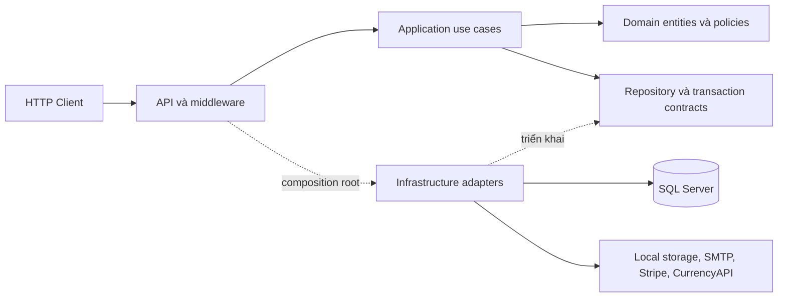

# ECommerceBackend


[](https://github.com/Giapnocap/ECommerceBackend/actions/workflows/ci.yml)

Đây là dự án REST API cho một hệ thống thương mại điện tử mình xây dựng bằng ASP.NET Core 8,
Entity Framework Core và SQL Server. Mình dùng dự án này để học sâu hơn về những phần thường khó
thấy trong một CRUD đơn giản: Transaction, xử lý đồng thời, phân quyền, vòng đời đơn hàng và giữ dữ
liệu nhất quán khi có lỗi.

Dự án được làm theo hướng `production-oriented`. Repository tập trung vào backend, database, test
và cách chạy local; frontend được tách riêng.

## Công nghệ

| Nhóm | Công nghệ |
| --- | --- |
| Nền tảng | .NET 8, ASP.NET Core Web API |
| Dữ liệu | Entity Framework Core 8, SQL Server 2022 |
| Xác thực | JWT Bearer, BCrypt, Refresh Token |
| Validation | FluentValidation |
| Logging và quan sát | Serilog, OpenTelemetry, correlation ID, health checks |
| API | REST, Swagger/OpenAPI, API versioning, ProblemDetails |
| Kiểm thử | xUnit, ASP.NET Core integration test, SQL Server integration test |
| Công cụ | Docker Compose, GitHub Actions |

## Chức năng chính

- Đăng ký, đăng nhập, Refresh Token, đăng xuất theo phiên, quên mật khẩu và xác minh email.
- Phân quyền cho `Admin`, `Staff`, `Customer` bằng role, permission policy và kiểm tra chủ sở hữu dữ liệu.
- Quản lý danh mục, sản phẩm, ảnh sản phẩm, tồn kho và lịch sử thay đổi tồn kho.
- Tìm kiếm, lọc, sắp xếp, phân trang sản phẩm và quản lý giỏ hàng.
- Báo giá phía server, mã khuyến mãi, phí giao hàng, thuế và checkout.
- Xử lý vòng đời đơn hàng, giao hàng, hủy đơn, trả hàng và hoàn tiền.
- Thanh toán COD; có adapter cho Stripe PaymentIntent, Webhook và reconciliation khi bật cấu hình.
- Dashboard, báo cáo, audit log, Outbox dead-letter, đối soát file upload và data retention.

## Những phần mình tập trung nhiều nhất

Phần khó nhất với mình là checkout và payment. Một lần đặt hàng phải chạm vào cart, product, order,
payment, inventory ledger và notification. Nếu một bước lỗi mà các bước trước đã ghi xuống database
thì dữ liệu rất dễ lệch. Vì vậy checkout khóa cart và product theo thứ tự ổn định, thực hiện các thay
đổi trong một Transaction rồi mới commit.

Mình thêm `Idempotency-Key` vì request checkout có thể bị gửi lại khi mạng chậm hoặc client retry.
Key được lưu cùng hash của request; gửi lại cùng nội dung sẽ nhận lại đơn cũ, còn dùng lại key cho
nội dung khác sẽ bị từ chối. Cách này cũng được bảo vệ thêm bằng unique constraint ở database.

Mình chọn Transactional Outbox cho email và thông báo vì không muốn gửi email xong rồi Transaction
nghiệp vụ lại rollback. Message được ghi cùng dữ liệu nghiệp vụ, sau commit mới có worker lấy ra gửi.
Worker có lease, retry, dead-letter và redrive; việc gửi theo mô hình at-least-once.

Trong quá trình làm, phần order từng chứa quá nhiều luồng trong các service lớn. Mình đã đổi hướng,
giữ `OrderService` làm facade cho controller và tách checkout, cập nhật trạng thái, giao hàng, trả
hàng, hoàn tiền thành các use case nhỏ hơn. Controller vẫn làm việc qua một facade ổn định, còn code
phía sau dễ lần theo hơn.

Một số điểm kỹ thuật khác:

- Row Version, ETag, SQL lock, unique constraint và state machine bảo vệ các luồng có cạnh tranh dữ liệu.
- Order lưu snapshot người nhận, tên sản phẩm, giá, promotion và tiền tệ để lịch sử không phụ thuộc catalog hiện tại.
- Mọi thay đổi tồn kho đều tạo inventory transaction kèm số dư sau thay đổi.
- Stripe I/O được thực hiện ngoài SQL Transaction dài; Webhook kiểm tra chữ ký, event, amount và currency.
- API lỗi dùng `ProblemDetails`; log, trace và audit được nối với nhau bằng correlation ID.

## Kiến trúc

Hệ thống là modular monolith gồm một ASP.NET Core API và một SQL Server database. Solution được tách
thành bốn project để dependency đi theo một chiều rõ ràng.


```mermaid
flowchart LR
    Client[HTTP Client] --> API[API và middleware]
    API --> Application[Application use cases]
    Application --> Domain[Domain entities và policies]
    Application --> Contracts[Repository và transaction contracts]
    Infrastructure[Infrastructure adapters] -. triển khai .-> Contracts
    Infrastructure --> Database[(SQL Server)]
    Infrastructure --> External[Local storage, SMTP, Stripe, CurrencyAPI]
    API -. composition root .-> Infrastructure
```

| Project | Trách nhiệm |
| --- | --- |
| `src/ECommerceBackend` | Controller, middleware, authentication, authorization, Swagger và cấu hình host |
| `src/ECommerceBackend.Application` | DTO, validation, use case, interface và điều phối Transaction |
| `src/ECommerceBackend.Domain` | Entity, invariant, state transition và business policy |
| `src/ECommerceBackend.Infrastructure` | EF Core, repository, SQL locking, external adapter và background worker |
| `tests` | Unit test và integration test |

`Program.cs` là composition root. Controller chỉ xử lý HTTP contract; business rule nằm ở Domain và
Application; Infrastructure triển khai repository cùng các adapter bên ngoài. Chi tiết hơn có trong
[tài liệu kiến trúc](docs/ARCHITECTURE.md).

## Luồng checkout

```text
HTTP request
  -> authentication, authorization và validation
  -> kiểm tra Idempotency-Key
  -> bắt đầu Transaction, khóa cart và product
  -> tính lại giá, promotion, phí giao hàng và thuế phía server
  -> tạo order/payment snapshot, giữ tồn kho, ghi ledger, history và Outbox
  -> xóa cart, SaveChanges và commit
  -> trả đơn vừa tạo hoặc đơn cũ nếu đây là một lần retry hợp lệ
```

Backend không nhận tổng tiền do client tự tính. Nếu stock, giá hoặc promotion không còn hợp lệ,
Transaction được rollback và không để lại order hay inventory ledger viết dở.

## Xác thực và phân quyền

Access Token dùng JWT. Refresh Token được hash trước khi lưu, xoay vòng theo token family và thu hồi
cả family khi phát hiện token cũ bị dùng lại. Mỗi request cần đăng nhập còn kiểm tra `TokenVersion`
và session đang hoạt động trong SQL Server.

`Admin`, `Staff`, `Customer` là các vai trò nghiệp vụ. Những endpoint quản trị dùng permission như
`manage_users`, `manage_products`, `process_orders`, `view_inventory` và `view_reports`; các luồng
cart, order, cancel và return của Customer còn kiểm tra đúng chủ sở hữu. Đổi mật khẩu, đổi vai trò,
logout-all hoặc khóa tài khoản đều làm mất hiệu lực phiên liên quan.

## Thanh toán

COD là phương thức mặc định. Khi bật Stripe và cung cấp key qua cấu hình môi trường, hệ thống có thể
tạo PaymentIntent, nhận Webhook, đối soát payment bị stale và xử lý partial/full refund. Application
làm việc qua `IPaymentProvider` và `IPaymentGateway`, nên phần nghiệp vụ không phụ thuộc trực tiếp vào
HTTP contract của Stripe.

Các bước tạo payment, xử lý Webhook và refund đều có Idempotency cùng state transition. Sequence chi
tiết nằm trong [docs/SEQUENCES.md](docs/SEQUENCES.md); các trường hợp lỗi và cách phục hồi nằm trong
[docs/ARCHITECTURE.md](docs/ARCHITECTURE.md).

## Kiểm thử và chất lượng

Test được tách thành hai project. Unit test kiểm tra domain invariant, state machine, money và
validation. Integration test kiểm tra service, API contract, authorization, adapter và các luồng
nghiệp vụ. Một nhóm test riêng chạy với SQL Server thật để kiểm tra migration, constraint,
Transaction, lock và race condition mà EF InMemory không mô phỏng được.

CI hiện chạy secret scan, NuGet audit, format check, Release build, unit/integration test, SQL Server
test, migration artifact và Docker smoke test. Coverage cũng là một gate của CI: line tối thiểu 80%
và branch tối thiểu 60%. Mình không ghi tổng số test cố định ở README vì con số này thay đổi mỗi khi
bổ sung test; kết quả của lần kiểm tra gần nhất được lưu trong
[PRODUCTION_READINESS_REPORT.md](PRODUCTION_READINESS_REPORT.md).

## Khởi chạy nhanh

Cần cài Git và Docker Desktop có Docker Compose.

```powershell
git clone https://github.com/Giapnocap/ECommerceBackend.git
Set-Location ECommerceBackend
Copy-Item .env.example .env
```

Mở `.env` và thay `MSSQL_SA_PASSWORD`, `JWT_KEY` bằng giá trị local của bạn. Nếu cần tạo Admin đầu
tiên, điền các biến `ADMIN_BOOTSTRAP_*`, đặt `ADMIN_BOOTSTRAP_ENABLED=true` và dùng password dài từ
12 đến 128 ký tự. Không commit file `.env`.

```powershell
docker compose up --build --detach
docker compose ps
```

Compose khởi động SQL Server, chạy migration rồi mới chạy API. Các địa chỉ mặc định:

- Swagger UI: <http://localhost:5171/swagger>
- Liveness: <http://localhost:5171/health/live>
- Readiness: <http://localhost:5171/health/ready>

Sau khi Admin được tạo, đặt lại `ADMIN_BOOTSTRAP_ENABLED=false` và khởi động lại API.

### Dữ liệu demo

Sau khi migration xong, có thể seed dữ liệu demo vào database local. Thay password trong lệnh bằng
`MSSQL_SA_PASSWORD` của file `.env`.

```powershell
sqlcmd -S localhost,1433 -U sa -P "<MSSQL_SA_PASSWORD>" -C -d ECommerceDB -b -f 65001 -v EnvironmentName=Development -i scripts/SeedDemoData.sql
```

Script chỉ chấp nhận môi trường `Development`, `Local` hoặc `Testing`. Để dừng ứng dụng mà vẫn giữ
database, ảnh, Data Protection keys và log local:

```powershell
docker compose down
```

## API và tài liệu

Route chuẩn là `/api/v1`; `/api` vẫn là alias dùng phiên bản v1. Swagger được bật theo cấu hình môi
trường, còn [ECommerceBackend.http](src/ECommerceBackend/ECommerceBackend.http) chứa một số request
mẫu. Lỗi API trả về `application/problem+json` với error code và `traceId`.

Các tài liệu mình dùng để ghi lại phần chi tiết:

- [Kiến trúc và consistency rule](docs/ARCHITECTURE.md)
- [ERD](docs/ERD.md)
- [Sequence nghiệp vụ](docs/SEQUENCES.md)
- [Kịch bản demo](docs/DEMO.md)
- [Monitoring](docs/MONITORING.md)
- [Performance baseline](docs/PERFORMANCE.md)
- [Runbook](docs/RUNBOOK.md)
- [Giới hạn hiện tại](docs/LIMITATIONS.md)
- [Báo cáo capability](FULL_UPGRADE_REPORT.md)
- [Kết quả kiểm tra gần nhất](PRODUCTION_READINESS_REPORT.md)

## Giới hạn hiện tại

Hiện mình chạy dự án với một API instance, một SQL Server và nơi lưu ảnh trên local volume. Rate
limiter cùng FX cache cũng đang nằm trong process vì quy mô portfolio chưa cần Redis hay object
storage. Stripe, CurrencyAPI và SMTP đã có adapter và test qua adapter giả lập, nhưng mình chưa
chạy end-to-end bằng tài khoản dịch vụ thật. Mình ghi rõ phần còn lại và lý do chưa làm trong
[docs/LIMITATIONS.md](docs/LIMITATIONS.md).
