# Database ERD

The database keeps current operational state and immutable histories in the same SQL Server
database. Orders preserve recipient contact, while order details preserve product name and price
snapshots; inventory and payment histories remain auditable after profile or catalog data changes.

```mermaid
erDiagram
    USERS {
        uniqueidentifier Id PK
        nvarchar UserName UK
        nvarchar Email UK
        datetime2 EmailVerifiedAt
        int TokenVersion
        rowversion RowVersion
    }
    ROLES {
        uniqueidentifier Id PK
        nvarchar Name UK
    }
    PERMISSIONS {
        uniqueidentifier Id PK
        nvarchar Name UK
    }
    USER_ROLES {
        uniqueidentifier UserId PK,FK
        uniqueidentifier RoleId FK
    }
    ROLE_PERMISSIONS {
        uniqueidentifier RoleId PK,FK
        uniqueidentifier PermissionId PK,FK
    }
    REFRESH_TOKENS {
        uniqueidentifier Id PK
        uniqueidentifier UserId FK
        uniqueidentifier FamilyId
        nvarchar TokenHash UK
        datetime2 ExpiresAt
    }
    PASSWORD_RESET_TOKENS {
        uniqueidentifier Id PK
        uniqueidentifier UserId FK
        nvarchar TokenHash UK
        datetime2 ExpiresAt
    }
    EMAIL_VERIFICATION_TOKENS {
        uniqueidentifier Id PK
        uniqueidentifier UserId FK
        nvarchar TokenHash UK
        datetime2 ExpiresAt
        datetime2 UsedAt
    }
    CATEGORIES {
        uniqueidentifier Id PK
        uniqueidentifier ParentId FK
        nvarchar NormalizedName
        bit IsDeleted
    }
    PRODUCTS {
        uniqueidentifier Id PK
        uniqueidentifier CategoryId FK
        decimal Price
        int StockQuantity
        int LowStockThreshold
        bit IsDeleted
        rowversion RowVersion
    }
    PRODUCT_IMAGES {
        uniqueidentifier Id PK
        uniqueidentifier ProductId FK
        nvarchar ImageUrl
        bit IsMain
    }
    CARTS {
        uniqueidentifier Id PK
        uniqueidentifier UserId FK,UK
    }
    CART_ITEMS {
        uniqueidentifier Id PK
        uniqueidentifier CartId FK
        uniqueidentifier ProductId FK
        int Quantity
        decimal UnitPrice
    }
    ORDERS {
        uniqueidentifier Id PK
        uniqueidentifier UserId FK
        uniqueidentifier PromotionId FK
        nvarchar OrderNumber UK
        nvarchar IdempotencyKey
        nvarchar PromotionCodeSnapshot
        int ShippingMethod
        nvarchar RecipientName
        nvarchar RecipientPhone
        nvarchar ShippingAddress
        nvarchar Currency
        nvarchar BaseCurrency
        decimal ExchangeRate
        datetime2 ExchangeRateCapturedAt
        int Status
        decimal SubtotalAmount
        decimal DiscountAmount
        decimal ShippingFee
        decimal TaxAmount
        decimal TotalAmount
        decimal BaseSubtotalAmount
        decimal BaseDiscountAmount
        decimal BaseShippingFee
        decimal BaseTaxAmount
        decimal BaseTotalAmount
        datetime2 ExpiresAt
        rowversion RowVersion
    }
    ORDER_DETAILS {
        uniqueidentifier Id PK
        uniqueidentifier OrderId FK
        uniqueidentifier ProductId FK
        nvarchar ProductNameSnapshot
        decimal UnitPrice
        decimal BaseUnitPrice
        int Quantity
    }
    ORDER_STATUS_HISTORIES {
        uniqueidentifier Id PK
        uniqueidentifier OrderId FK
        uniqueidentifier ChangedByUserId FK
        int FromStatus
        int ToStatus
        datetime2 CreatedAt
    }
    SHIPMENTS {
        uniqueidentifier Id PK
        uniqueidentifier OrderId FK,UK
        nvarchar Carrier
        nvarchar TrackingNumber UK
        datetime2 ShippedAt
        datetime2 DeliveredAt
        rowversion RowVersion
    }
    RETURN_REQUESTS {
        uniqueidentifier Id PK
        uniqueidentifier OrderId FK,UK
        uniqueidentifier RequestedByUserId FK
        int Status
        nvarchar Reason
        datetime2 RequestedAt
        datetime2 ReviewedAt
        datetime2 ReceivedAt
        datetime2 RefundedAt
        rowversion RowVersion
    }
    PROMOTIONS {
        uniqueidentifier Id PK
        nvarchar NormalizedCode UK
        int Type
        decimal Value
        decimal MinimumSubtotal
        int UsageLimit
        int UsedCount
        datetime2 StartsAt
        datetime2 EndsAt
        rowversion RowVersion
    }
    PROMOTION_REDEMPTIONS {
        uniqueidentifier Id PK
        uniqueidentifier PromotionId FK
        uniqueidentifier OrderId FK,UK
        uniqueidentifier UserId FK
        decimal DiscountAmount
        datetime2 CreatedAt
    }
    PAYMENTS {
        uniqueidentifier Id PK
        uniqueidentifier OrderId FK,UK
        int Method
        int Status
        decimal Amount
        nvarchar Currency
        decimal RefundedAmount
        nvarchar Provider
        nvarchar ProviderTransactionId
        nvarchar ExternalCreationIdempotencyKey UK
        datetime2 ExternalCreationLeaseUntil
        datetime2 LastProviderEventAt
        datetime2 LastReconciledAt
        datetime2 PaidAt
        rowversion RowVersion
    }
    PAYMENT_REFUNDS {
        uniqueidentifier Id PK
        uniqueidentifier PaymentId FK
        uniqueidentifier RequestedByUserId FK
        nvarchar IdempotencyKey
        decimal Amount
        nvarchar Currency
        decimal BaseAmount
        nvarchar BaseCurrency
        int Status
        nvarchar ProviderRefundId UK
        int AttemptCount
        datetime2 ProcessingLeaseUntil
        rowversion RowVersion
    }
    PAYMENT_STATUS_HISTORIES {
        uniqueidentifier Id PK
        uniqueidentifier PaymentId FK
        int FromStatus
        int ToStatus
        int Source
        datetime2 OccurredAt
    }
    PAYMENT_WEBHOOK_EVENTS {
        uniqueidentifier Id PK
        uniqueidentifier PaymentId FK
        nvarchar Provider
        nvarchar EventId
        nvarchar PayloadHash
    }
    INVENTORY_TRANSACTIONS {
        uniqueidentifier Id PK
        uniqueidentifier ProductId FK
        uniqueidentifier OrderId FK
        int QuantityChange
        int BalanceAfter
        int Type
    }
    OUTBOX_MESSAGES {
        uniqueidentifier Id PK
        nvarchar Type
        datetime2 OccurredAt
        datetime2 ProcessedAt
        datetime2 DeadLetteredAt
    }
    AUDIT_EVENTS {
        uniqueidentifier Id PK
        uniqueidentifier ActorUserId
        nvarchar Action
        nvarchar EntityType
        datetime2 OccurredAt
    }

    USERS ||--|| CARTS : owns
    USERS ||--o{ USER_ROLES : has
    ROLES ||--o{ USER_ROLES : assigned
    ROLES ||--o{ ROLE_PERMISSIONS : grants
    PERMISSIONS ||--o{ ROLE_PERMISSIONS : contains
    USERS ||--o{ REFRESH_TOKENS : sessions
    USERS ||--o{ PASSWORD_RESET_TOKENS : resets
    USERS ||--o{ EMAIL_VERIFICATION_TOKENS : verifies
    USERS ||--o{ ORDERS : places
    USERS ||--o{ PROMOTION_REDEMPTIONS : redeems
    CATEGORIES o|--o{ CATEGORIES : parent
    CATEGORIES ||--o{ PRODUCTS : groups
    PRODUCTS ||--o{ PRODUCT_IMAGES : has
    CARTS ||--o{ CART_ITEMS : contains
    PRODUCTS ||--o{ CART_ITEMS : selected
    ORDERS ||--|{ ORDER_DETAILS : snapshots
    PRODUCTS ||--o{ ORDER_DETAILS : references
    ORDERS ||--o{ ORDER_STATUS_HISTORIES : records
    ORDERS ||--o| SHIPMENTS : fulfills
    ORDERS ||--o| RETURN_REQUESTS : returns
    USERS ||--o{ RETURN_REQUESTS : requests
    PROMOTIONS o|--o{ ORDERS : snapshots
    PROMOTIONS ||--o{ PROMOTION_REDEMPTIONS : limits
    ORDERS ||--o| PROMOTION_REDEMPTIONS : consumes
    ORDERS ||--|| PAYMENTS : payment
    USERS ||--o{ PAYMENT_REFUNDS : requests
    PAYMENTS ||--o{ PAYMENT_REFUNDS : refunds
    PAYMENTS ||--o{ PAYMENT_STATUS_HISTORIES : records
    PAYMENTS ||--o{ PAYMENT_WEBHOOK_EVENTS : receives
    PRODUCTS ||--o{ INVENTORY_TRANSACTIONS : ledger
    ORDERS o|--o{ INVENTORY_TRANSACTIONS : causes
```

Filtered unique indexes enforce active category names and one main image per product. Additional
unique constraints protect cart lines, order idempotency, webhook event identity and inventory
movement identity. See `AppDbContext` and the EF migrations for the complete physical schema.
