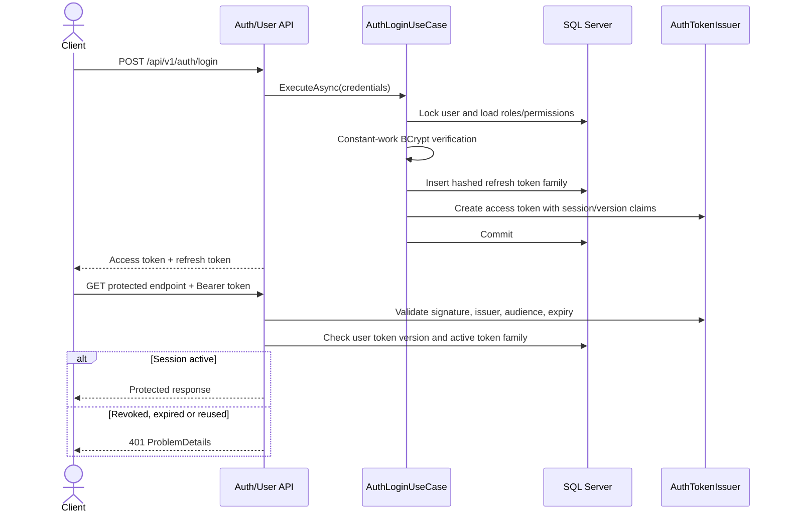
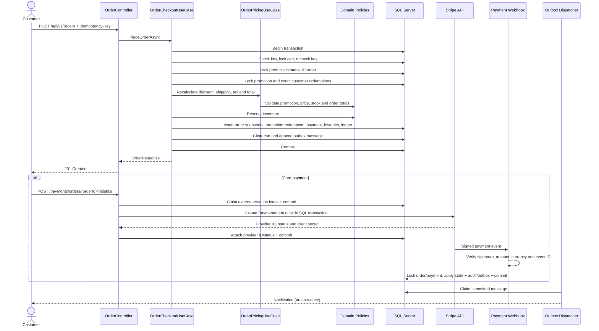
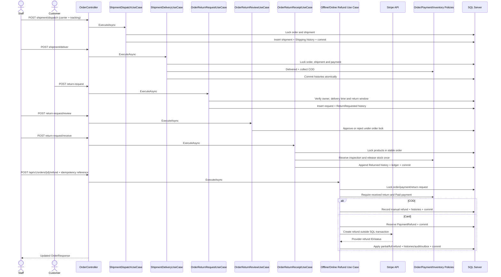
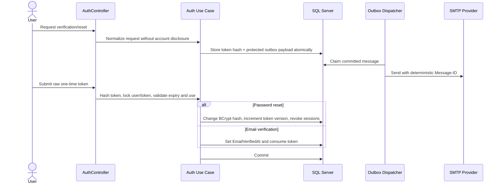

# Critical Sequences

## Login And Session Validation

## Idempotent Checkout And Online Payment

Concurrent retries with the same user and key return the original order. Reusing the key with a
different request returns `409`; unavailable stock rolls back the complete transaction. Stripe
network I/O never runs while checkout or inventory locks are held. A missing webhook is repaired
by the reconciliation worker querying a bounded batch of stale active PaymentIntents and locking
each order/payment before applying the observed state.

## Delivery, Return And Refund

Receiving returned goods and refund are separate auditable actions. Replaying the same reference is
idempotent; a reused reference with different content cannot overwrite financial history. Online
refunds preserve payment currency and order base-currency snapshots, and the cumulative amount is
bounded by the captured payment.

## Email Verification And Password Reset

Raw tokens are not stored as readable database values. Email verification is recorded but is not
currently a prerequisite for login.
