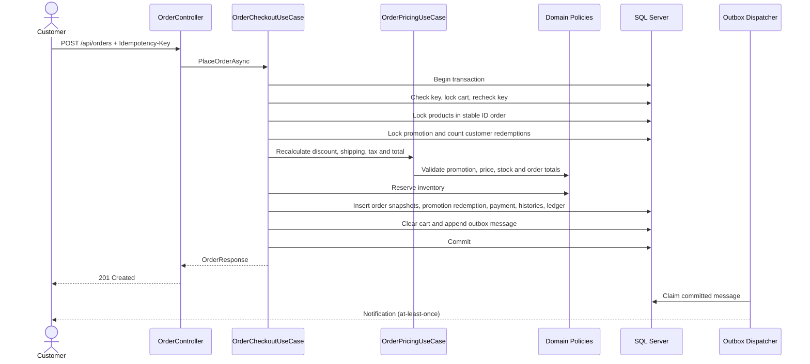
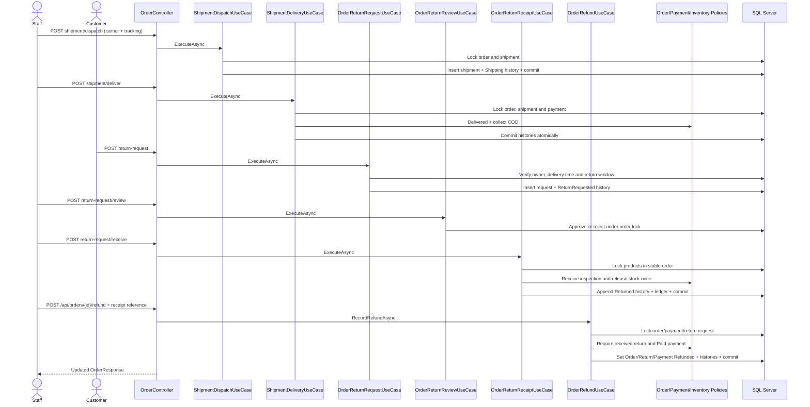

# Critical Sequences

## Login And Session Validation

## Idempotent COD Checkout

Concurrent retries with the same user and key return the original order. Reusing the key with a
different request returns `409`; unavailable stock rolls back the complete transaction.

## Delivery, Return And Refund

Receiving returned goods and offline COD refund are separate auditable actions. Replaying the same refund
reference is idempotent; a different reference cannot overwrite the recorded financial history.
