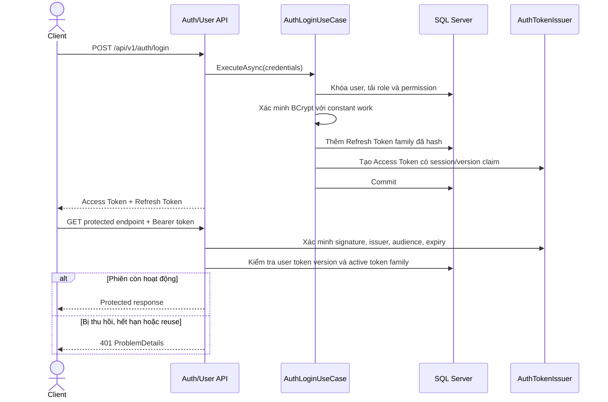
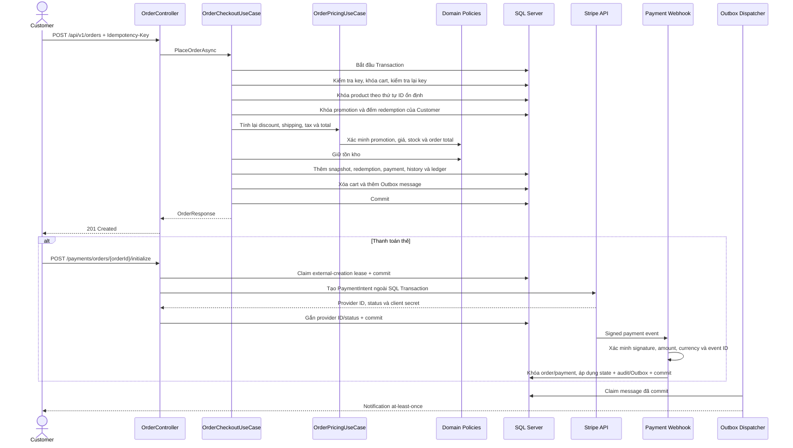
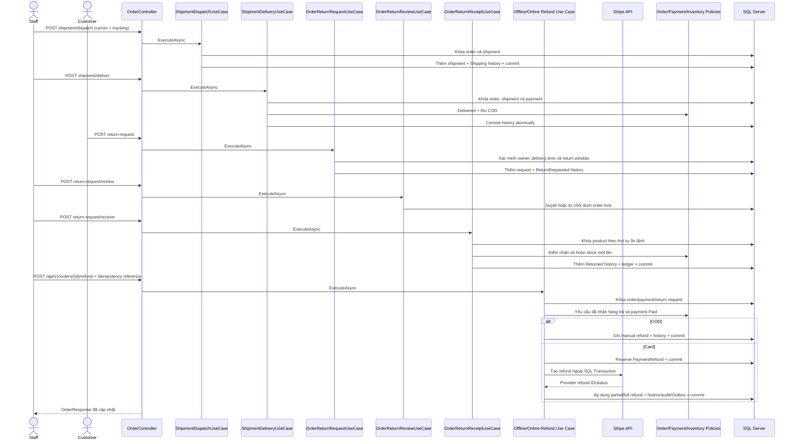
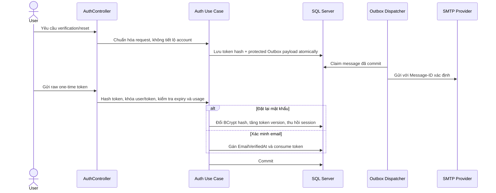

# Sơ đồ tuần tự các luồng quan trọng

## Đăng nhập và xác minh phiên

```mermaid
sequenceDiagram
    actor Client
    participant API as Auth/User API
    participant Auth as AuthLoginUseCase
    participant DB as SQL Server
    participant JWT as AuthTokenIssuer

    Client->>API: POST /api/v1/auth/login
    API->>Auth: ExecuteAsync(credentials)
    Auth->>DB: Khóa user, tải role và permission
    Auth->>Auth: Xác minh BCrypt với constant work
    Auth->>DB: Thêm Refresh Token family đã hash
    Auth->>JWT: Tạo Access Token có session/version claim
    Auth->>DB: Commit
    API-->>Client: Access Token + Refresh Token

    Client->>API: GET protected endpoint + Bearer token
    API->>JWT: Xác minh signature, issuer, audience, expiry
    API->>DB: Kiểm tra user token version và active token family
    alt Phiên còn hoạt động
        API-->>Client: Protected response
    else Bị thu hồi, hết hạn hoặc reuse
        API-->>Client: 401 ProblemDetails
    end
```

## Checkout idempotent và thanh toán online

```mermaid
sequenceDiagram
    actor Customer
    participant API as OrderController
    participant Checkout as OrderCheckoutUseCase
    participant Pricing as OrderPricingUseCase
    participant Rules as Domain Policies
    participant DB as SQL Server
    participant Stripe as Stripe API
    participant Webhook as Payment Webhook
    participant Outbox as Outbox Dispatcher

    Customer->>API: POST /api/v1/orders + Idempotency-Key
    API->>Checkout: PlaceOrderAsync
    Checkout->>DB: Bắt đầu Transaction
    Checkout->>DB: Kiểm tra key, khóa cart, kiểm tra lại key
    Checkout->>DB: Khóa product theo thứ tự ID ổn định
    Checkout->>DB: Khóa promotion và đếm redemption của Customer
    Checkout->>Pricing: Tính lại discount, shipping, tax và total
    Pricing->>Rules: Xác minh promotion, giá, stock và order total
    Checkout->>Rules: Giữ tồn kho
    Checkout->>DB: Thêm snapshot, redemption, payment, history và ledger
    Checkout->>DB: Xóa cart và thêm Outbox message
    Checkout->>DB: Commit
    Checkout-->>API: OrderResponse
    API-->>Customer: 201 Created
    alt Thanh toán thẻ
        Customer->>API: POST /payments/orders/{orderId}/initialize
        API->>DB: Claim external-creation lease + commit
        API->>Stripe: Tạo PaymentIntent ngoài SQL Transaction
        Stripe-->>API: Provider ID, status và client secret
        API->>DB: Gắn provider ID/status + commit
        Stripe->>Webhook: Signed payment event
        Webhook->>Webhook: Xác minh signature, amount, currency và event ID
        Webhook->>DB: Khóa order/payment, áp dụng state + audit/Outbox + commit
    end
    Outbox->>DB: Claim message đã commit
    Outbox-->>Customer: Notification at-least-once
```

Retry đồng thời với cùng user và key trả order ban đầu. Dùng lại key với request khác trả `409`;
stock không khả dụng rollback toàn bộ Transaction. Stripe network I/O không chạy khi checkout hoặc
inventory lock đang được giữ. Webhook bị lỡ được reconciliation worker sửa bằng cách truy vấn batch
PaymentIntent active bị stale có giới hạn và khóa từng order/payment trước khi áp dụng state quan
sát được.

## Giao hàng, trả hàng và hoàn tiền

```mermaid
sequenceDiagram
    actor Staff
    actor Customer
    participant API as OrderController
    participant Dispatch as ShipmentDispatchUseCase
    participant Delivery as ShipmentDeliveryUseCase
    participant ReturnRequest as OrderReturnRequestUseCase
    participant ReturnReview as OrderReturnReviewUseCase
    participant ReturnReceipt as OrderReturnReceiptUseCase
    participant Refund as Offline/Online Refund Use Case
    participant Gateway as Stripe API
    participant Rules as Order/Payment/Inventory Policies
    participant DB as SQL Server

    Staff->>API: POST shipment/dispatch (carrier + tracking)
    API->>Dispatch: ExecuteAsync
    Dispatch->>DB: Khóa order và shipment
    Dispatch->>DB: Thêm shipment + Shipping history + commit

    Staff->>API: POST shipment/deliver
    API->>Delivery: ExecuteAsync
    Delivery->>DB: Khóa order, shipment và payment
    Delivery->>Rules: Delivered + thu COD
    Delivery->>DB: Commit history atomically

    Customer->>API: POST return-request
    API->>ReturnRequest: ExecuteAsync
    ReturnRequest->>DB: Xác minh owner, delivery time và return window
    ReturnRequest->>DB: Thêm request + ReturnRequested history
    Staff->>API: POST return-request/review
    API->>ReturnReview: ExecuteAsync
    ReturnReview->>DB: Duyệt hoặc từ chối dưới order lock
    Staff->>API: POST return-request/receive
    API->>ReturnReceipt: ExecuteAsync
    ReturnReceipt->>DB: Khóa product theo thứ tự ổn định
    ReturnReceipt->>Rules: Kiểm nhận và hoàn stock một lần
    ReturnReceipt->>DB: Thêm Returned history + ledger + commit

    Staff->>API: POST /api/v1/orders/{id}/refund + idempotency reference
    API->>Refund: ExecuteAsync
    Refund->>DB: Khóa order/payment/return request
    Refund->>Rules: Yêu cầu đã nhận hàng trả và payment Paid
    alt COD
        Refund->>DB: Ghi manual refund + history + commit
    else Card
        Refund->>DB: Reserve PaymentRefund + commit
        Refund->>Gateway: Tạo refund ngoài SQL Transaction
        Gateway-->>Refund: Provider refund ID/status
        Refund->>DB: Áp dụng partial/full refund + history/audit/Outbox + commit
    end
    API-->>Staff: OrderResponse đã cập nhật
```

Nhận hàng trả và refund là hai hành động có audit riêng. Replay cùng reference là idempotent; một
reference được dùng lại với content khác không thể ghi đè financial history. Online refund giữ
payment currency và order base-currency snapshot; cumulative amount bị giới hạn bởi captured
payment.

## Xác minh email và đặt lại mật khẩu

```mermaid
sequenceDiagram
    actor User
    participant API as AuthController
    participant Auth as Auth Use Case
    participant DB as SQL Server
    participant Outbox as Outbox Dispatcher
    participant SMTP as SMTP Provider

    User->>API: Yêu cầu verification/reset
    API->>Auth: Chuẩn hóa request, không tiết lộ account
    Auth->>DB: Lưu token hash + protected Outbox payload atomically
    Outbox->>DB: Claim message đã commit
    Outbox->>SMTP: Gửi với Message-ID xác định
    User->>API: Gửi raw one-time token
    API->>Auth: Hash token, khóa user/token, kiểm tra expiry và usage
    alt Đặt lại mật khẩu
        Auth->>DB: Đổi BCrypt hash, tăng token version, thu hồi session
    else Xác minh email
        Auth->>DB: Gán EmailVerifiedAt và consume token
    end
    Auth->>DB: Commit
```

Raw token không được lưu trong database ở dạng đọc được. Email verification được ghi nhận nhưng
hiện chưa phải điều kiện để login.
